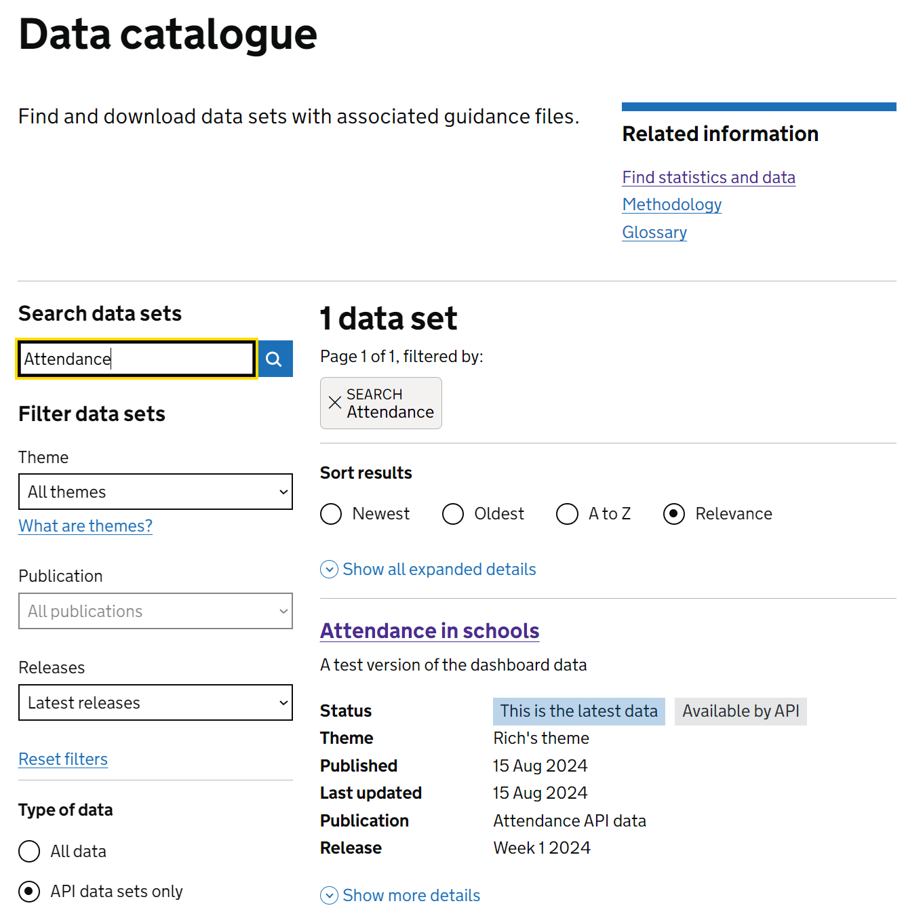
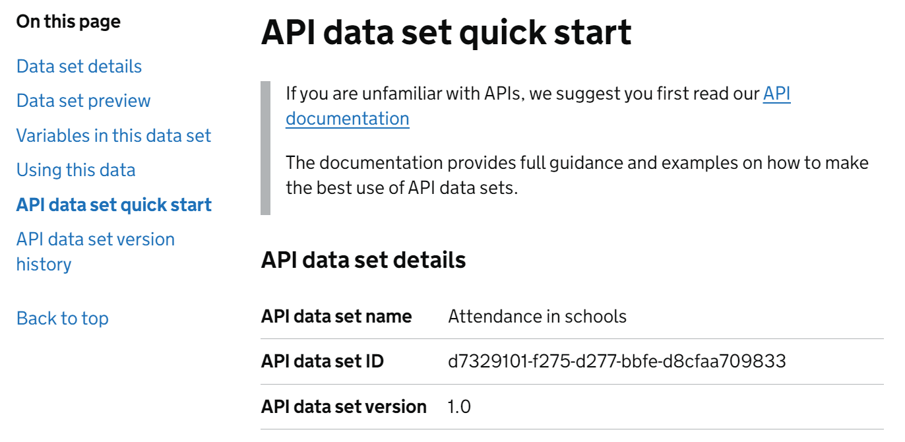

```{r, include = FALSE}
knitr::opts_chunk$set(
  collapse = TRUE,
  comment = "#>"
)
```

```{r setup}
```

The following article presents an example workflow of how, as an analyst, someone might
connect to the explore education statistics (EES) API to collect data with the help of
`eesyapi` in R.

As an overview, the stages you will likely need to follow are:

- Find the data set ID
- Query the data set meta data to identify filter and indicator IDs
- Design a query using the relevant IDs
- Post the query to the API
- Perform some post processing of the data

## Finding a data set ID

Only some data sets on EES are available via the EES API. This is to maintain 
minimum standards around the API data catalogue.

Assuming you know the data set within a publication that you would like to query, 
you will first need to identify the data set ID code. There are two methods to do 
this, either a) via the data set's page on the EES website or b) by querying the 
API itself.

### Identifying a data set ID via the API

Finding a data set ID via the API is a two step process. First, you'll need to find the parent publication ID and second, you'll need to search the data catalogue within that publication for the data set.

Querying the publication list:

```
eesyapi::get_publications()
```

This returns a list of all publications by ID and title (along with slug, summary and date last published). 
From this list, you can find the title of the publication that you're interested in and pick out the 
associated publication ID.

For example from the test list, we can pick out **"Attendance API data"**, which has an ID of 
**"b6d9ed96-be68-4791-abc3-08dcaba68c04"**. We can now use this in the function 
`eesyapi::get_data_catalogue()` to find all the data sets within that publication:

```
eesyapi::get_data_catalogue("b6d9ed96-be68-4791-abc3-08dcaba68c04")
```

This returns a data frame containing data set IDs and titles (along with a summary, the status and information on what's in the latest version). The data set IDs can be used as shown in the following sections to get a given data set's summary and meta data, and to query the data set itself.

### Finding a data set ID on the EES website

As with any other data set, you can find an API data set in the EES data catalogue. If you
know the name, you can filter the catalogue on this as normal. Not all data sets are accessible via the API, so to filter down to just those that are, click the **"API data sets only"** option as shown in the image below.



Once you've found the data set you need, then click on the title of the data set to be 
taken to it's details page in the catalogue. On this page (pictured below), you'll find the **API data set quick start** section, which gives the API data set name, **API data set ID** and API data set version. This **API data set ID** is what's needed below to query the data set and its meta data.



## Getting the data set meta data

When querying a data set via the API, indicator and filter items are referenced 
using auto-generated ID codes (known as SQIDs). Therefore, in order to construct a query that 
involves selecting a subset of filter items or indicators, you'll need to obtain
the codes associated with those elements.

All those filter item and indicator codes are stored in a data set's meta data, 
which can also be queried via the API. To get those codes as well as details on
what time periods and geographic levels and locations are available in a given
data set, you can use the function `eesyapi::get_meta()`, providing it with your 
data set's ID (which you can obtain either using `eesyapi::get_data_catalogue()` or via
the EES data catalogue). For example, to get the "attendance in schools" data from the example
attendance API data publication, you can take the data set ID 
`7c0e9201-c7c0-ff73-bee4-304e731ec0e6` and provide it as a parameter to `get_meta`:

```
eesyapi::get_meta(dataset_id = "7c0e9201-c7c0-ff73-bee4-304e731ec0e6")
```

This function returns a list of 5 data frames:

- `$time_periods`: label, code and period of all available time periods in the data set
- `$locations`: geographic_level, code, label and item_id of all available locations in the data set
- `$filter_columns`: col_name and label of all filters in the data set
- `$filter_items`: col_name, item_label, item_id and default_item for all filter items in the data set
- `$indicators`: col_name and label of all indicators in the data set

The item_id values provided in `$locations` and `$filter_items` are required to 
construct queries for filtering a given data set, whilst time periods can be 
filtered on the values in the `$time_period` code column.

In this example, let's say we've run `eesyapi::get_meta("7c0e9201-c7c0-ff73-bee4-304e731ec0e6")`
and we want to filter our data set to obtain data for:

- the "Week 26" time period in "2024", 
- "York" and "England" from the geographies,
- "Absence" from Attendance status
- "Approved educational activity", "Authorised" and "Unauthorised" from Attendance type
- Just the "Total" entries for "reason" and "day_number"
- And we want to see "Number of sessions" data values.

For this we would need the following codes / item_ids:

- "2024 W26"
- "jfhAM" and "dP0Zw"
- "7SdXo"
- "6AXrf", "0k3T5" and "YdkHK"
- "uLQo4" and "bBrtT"
- "bqZtT"

Note that whilst the above IDs are unique within a given item type (e.g. `filter_item`), they are
not necessarily unique between types. For example, a given `indicator` could be assigned the same 
ID as a `filter_item` in a given data set.

As a quick example of how you might quickly query the meta data for these codes, you could try the
following example pieces of query code.

### Time periods

``` {r}
eesyapi::get_meta(dataset_id = "7c0e9201-c7c0-ff73-bee4-304e731ec0e6") |>
  magrittr::extract2("time_periods") |>
  dplyr::filter(
    label %in% c("2024 Week 26")
  )
```

### Geographies
``` {r}
eesyapi::get_meta(dataset_id = "7c0e9201-c7c0-ff73-bee4-304e731ec0e6") |>
  magrittr::extract2("locations") |>
  dplyr::filter(label %in% c("York", "England"))
```

### Filter items

``` {r}
eesyapi::get_meta(dataset_id = "7c0e9201-c7c0-ff73-bee4-304e731ec0e6") |>
  magrittr::extract2("filter_items") |>
  dplyr::filter(
    item_label %in% c(
      "Absence", "Approved educational activity", "Authorised", "Unauthorised", "Total"
    )
  )
```

### Indicators

``` {r}
eesyapi::get_meta(dataset_id = "7c0e9201-c7c0-ff73-bee4-304e731ec0e6") |>
  magrittr::extract2("indicators") |>
  dplyr::filter(
    label %in% c("Session count")
  )
```

## Retrieving data from a data set

### Downloading an entire data set in a single file

Whilst specific queries (as detailed in the following sections) are best used for automated pipeline 
workflows, the EES API also offers the option
to just download the entirety of the underlying data file for a given data set. This bypasses the 
use of IDs, making it a simpler short-term option to retrieve data, but with the risk of creating
breaking changes in automated pipelines should element labels change.

Using `eesyapi`, you can retrieve a data set using `download_dataset()` and providing the data set 
ID as follows:

```
download_dataset("7c0e9201-c7c0-ff73-bee4-304e731ec0e6")
```

This will return a data frame containing the data in the form that DfE analysts uploaded it to 
EES in.

### Using `query_dataset()`

The recommended go-to option for retrieving data is the `query_dataset()` function. This provides
options for attaching a pre-made JSON file to a query, attaching a pre-made JSON string or passing
a set of IDs as parameters to create a query for you.

#### Querying a data set using parameters

`query_dataset()` can be given a set of parameters to build up a query for you. Behind the scenes
it creates a JSON string based on the parameters provided to it by the user. This inherently limits
the extent of the type of queries that you can perform, but it should cover most basic use cases.

The parameters that you'll can provide to build up your query are:
- `time_periods`
- `locations`
- `filter_items`
- `indicators` (required)

All these are optional, except for `indicators` which you must always specify. If you don't provide 
any of `time_periods`, `locations` or `filter_items`, then you'll receive all rows from the data 
set (although be careful, this may take some time for larger data sets).

Using the parameters we obtained from `get-meta` above, then we can create a query to return 
session count data for only **Approved educational activity**, **Authorised** and **Unauthorised** 
in the **Absences** category, **Nationally** for **York** in **Week 26** in **2024**, we would 
supply the following:

``` {r example-parameter-query}
eesyapi::query_dataset(
  dataset_id = "7c0e9201-c7c0-ff73-bee4-304e731ec0e6",
  indicators = "bqZtT",
  filter_items = list(
    attendance_status = c("7SdXo"),
    attendance_type = c("6AXrf", "0k3T5", "YdkHK"),
    day_number = "uLQo4",
    reason = "bBrtT"
  ),
  geographies = c("NAT|id|dP0Zw", "LA|ID|jfhAM"),
  time_periods = c("2024|W26")
)
```

Some notes on the above:

- `indicators`, `time_periods`, `geographies` and `filter_items` can all be supplied as vectors - 
`c(...)` - and will be interpreted as `filter(... %in% c(...))`.
- `filter_items` can be supplied as a list to create more stringent cross-filter combinations, i.e. 
in the above example rows will only be returned for the specific combinations given across the 4 
filters.
- `geographies` can be supplied as a data frame to allow for more complex queries such as "give me 
all LAs in a given region". The structure for this can be seen by calling `example_geography_query()`.


#### Querying a data set using a JSON file or string

If you're familiar with using JSON and wish to just write your own query from scratch, then you can 
use `query_dataset()` with the `json_query` parameter as follows:

``` {r example-json-string-query}
json_query <- "{
  \"criteria\": {
    \"and\": [
      {
        \"filters\": {
          \"eq\": \"7SdXo\"
        }
      },
      {
        \"locations\": {
          \"eq\": {
            \"level\": \"LA\",
            \"id\": \"jfhAM\"
          }
        }
      }
    ]
  },
  \"indicators\": [
    \"bqZtT\"
  ],
  \"debug\": false,
  \"page\": 1,
  \"pageSize\": 10
}"
eesyapi::query_dataset(
  dataset_id = "7c0e9201-c7c0-ff73-bee4-304e731ec0e6",
  json_query = json_query
)
```

## FAQs

### Why do you use IDs rather than the actual labels used in the data?

The IDs are intended to aid in future proofing for users that may develop automated pipelines that
connect to the EES API. Labeling inevitably changes, for example if a "Total" entry is renamed to
"All pupils" or "All schools" to add clarity. If the underlying content of that item stays
the same, then automated pipelines will be required to still connect to the same item, therefore 
each item has an associated ID that will remain unchanged in a given data set as it is updated with 
new data over the subsequent releases, even if a renaming of a field occurs.

### Are there any bandwidth / repeat connection constraints that I should know about?

There are currently no constraints whilst the system is being tested.
